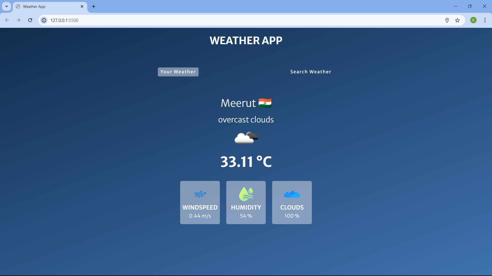
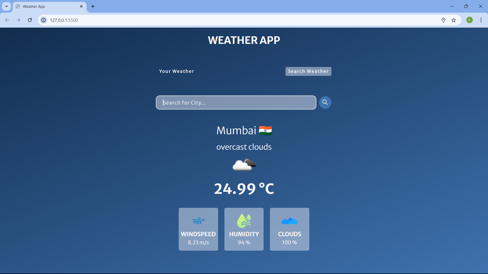

# 🌦️ Weather App

A simple weather application that allows users to get weather information for their current location or search for weather in other cities.

## 📋 Table of Contents

- [Features](#features)
- [Technologies](#technologies)
- [Setup](#setup)
- [Usage](#usage)
- [Screenshots](#screenshots)
- [License](#license)

## ✨ Features

- 🌍 Fetches weather information based on user's current location.
- 🔍 Allows users to search for weather information in any city.
- 🌡️ Displays weather details such as temperature, wind speed, humidity, and cloudiness.
- 📱 Responsive design.

## 🛠️ Technologies

- 🧾 HTML
- 🎨 CSS
- 📜 JavaScript
- 🌐 OpenWeatherMap API

## 🛠️ Setup

1. Clone the repository:
    ```bash
    git clone https://github.com/your-username/weather-app.git
    ```

2. Navigate to the project directory:
    ```bash
    cd weather-app
    ```

3. Open `index.html` in your browser to view the application.

## 🚀 Usage

1. 📍 Grant location access to get weather information for your current location.
2. 🏙️ Use the search tab to find weather information for any city.
3. 📊 View the displayed weather details, including temperature, wind speed, humidity, and cloudiness.

## 🖼️ Screenshots

### 🏠 Home Page


### ☀️Searched Weather Details


## 📄 License

This project is licensed under the MIT License - see the [LICENSE](LICENSE) file for details.
